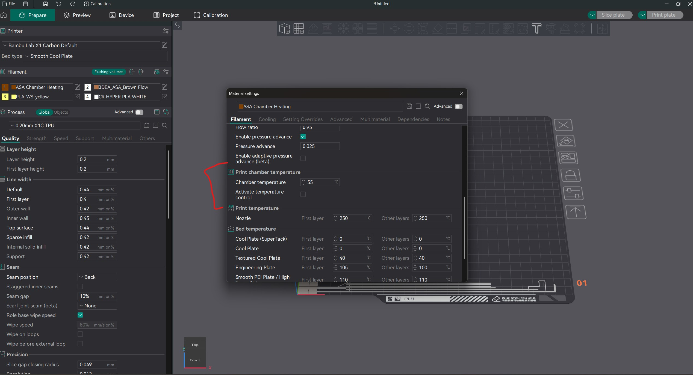

#   :fire: Bambu Lab & Tuya Heater Automation (n8n)

**Goal:** Use  n8n to automatically control a chamber heater (via  Tuya Smart Plug) based on the status of a  Bambu Lab 3D printer (e.g., turn ON when printing ABS/ASA, turn OFF when idle or finished).

**Prerequisites:**
*  Running **n8n** server (Self-hosted).
*  **Bambu Lab Printer** (P1/X1 series) with LAN Mode enabled (or cloud credentials).
*  **Tuya IoT Developer Account** (Free tier is fine).
*  **Tuya-compatible Smart Plug** controlling your heater.

---

## :package: Hardware links
* Heater: https://www.aliexpress.com/item/1005008379688337.html?mp=1&pdp_npi=6%40dis%21NZD%21NZD%2043.95%21NZD%2030.76%21%21NZD%2029.84%21%21%21%40210328c017680504728844834e073e%2112000044784322009%21ct%21NZ%21877674695%21%211%210%21
* Smart switch: https://www.aliexpress.com/item/1005005298261294.html?mp=1&pdp_npi=6%40dis%21NZD%21NZD%2020.23%21NZD%2010.24%21%21NZD%2010.14%21%21%21%40210328c017680504751634878e073e%2112000032537944217%21ct%21NZ%21877674695%21%212%210%21

---

## :camera: Screenshots (OrcaSlicer + n8n)
**OrcaSlicer chamber settings:** Enable chamber temperature and set the target for ABS/ASA. Do **not** enable active control (X1C firmware does not support it).



**n8n workflow:** The logic listens to printer status, checks high-temp materials, and toggles the Tuya plug to heat or stop.


---

## :hot_face: Heat soak via start G-code (any slicer)
Add a custom heat soak routine in your machine start G-code so high-temp materials warm the chamber before printing. This works in Bambu Studio or OrcaSlicer.

1) Find this section in your machine start G-code (around line 73):
```gcode
;===== heatbed preheat ====================
M1002 gcode_claim_action:54
M140 S[bed_temperature_initial_layer_single] ;set bed temp
M190 S[bed_temperature_initial_layer_single] ;wait for bed temp
```

2) Replace it with this block:
```gcode
; --- MOD START: MQTT Heat Soak Trigger (>85C Only) ---
; Only runs if the sliced bed temp is STRICTLY greater than 85C.
; This ignores PLA, PETG, and TPU completely.
{if bed_temperature_initial_layer_single > 85}
    M1002 gcode_claim_action : 2
    M140 S100    ; Force Bed to 100C for the soak
    M106 P3 S255 ; Turn Aux Fan to 100% to circulate heat
    G0 X128 Y250 F12000 ; Park toolhead at the back
    M400 U1      ; Sync moves
    M25          ; PAUSE PRINT (Triggers MQTT status: PAUSE)
{endif}
; --- MOD END ---
```

Note: the workflow currently resumes at **47C** (good if you do not have a heater installed yet). With a heater installed, bump the resume threshold to **55–60C**. Without a heater, the bed alone can take a long time to reach higher chamber temps.

Summary:
- Original code: only heats the bed and starts printing when the bed hits target.
- New code: if bed target is > 90C, it runs a heat soak routine to warm the chamber first.

---

## :wrench: Step 1: Configure  n8n Environment
The  Tuya API requires cryptographic signing (HMAC-SHA256). By default,  n8n blocks the `crypto` module in the "Code" node.

1. Open your n8n Docker configuration (e.g., `docker-compose.yml` or Unraid template).
2. Add the following environment variable:
    ```bash
    NODE_FUNCTION_ALLOW_BUILTIN=crypto
    ```
    *(Alternatively, set it to `*` to allow all built-in modules.)*
3. **Restart your n8n container** for changes to take effect.

---

## :key: Step 2: Get  Tuya API Credentials
To control the plug via script, you need "Cloud" access, not just the App.

1. Go to [Tuya IoT Platform](https://iot.tuya.com/) and log in.
2. **Cloud > Development > Create Project**.
3. Link your Tuya App account:
    * Go to **Devices > Link Tuya App Account**.
    * Scan the QR code with the Tuya Smart App on your phone.
    * Your smart plug should now appear in the device list.
4. Copy these 3 values for later:
    * **Access ID (Client ID)**
    * **Access Secret (Client Secret)**
    * **Device ID** (of the smart plug)

---

## :gear: Step 3: The  n8n Workflow
Create a new workflow in  n8n.

### **Node 1: Trigger ( Bambu Lab)**
* **Node Type:** MQTT Trigger (if using LAN mode) or HTTP Polling (if using Cloud).
* **Recommended (MQTT):**
    * **Topic:** `device/[YOUR_SERIAL_NUMBER]/report`
    * **Credentials:** Printer IP, Port `8883`, User `bblp`, Password `[ACCESS_CODE]`.
    * *Note: This gives you live data like `nozzle_temp`, `chamber_temp`, and `gcode_state`.*

### **Node 2: Filter / Switch (Logic)**
* **Node Type:** Switch (or If).
* **Logic:**
    * Check `gcode_state`: Is it `RUNNING`?
    * Check Filament type (if available in payload) or Bed Temp: Is it > 90C (implies ABS/ASA)?
    * Check Chamber Temp: Is it < 45C?
* **Outcome:** If Printing ABS **AND** Chamber is Cold -> **Route to "Turn ON"**.

### **Node 3: The  Tuya Signer (JavaScript)**
This is the tricky part. You need to generate a signature for the API request.
* **Node Type:** Code (JavaScript).
* **Code Snippet:**
    ```javascript
    const crypto = require('crypto');

    // Your Credentials
    const clientId = 'YOUR_ACCESS_ID';
    const clientSecret = 'YOUR_ACCESS_SECRET';
    const deviceId = 'YOUR_DEVICE_ID';

    // Timestamp
    const t = Date.now().toString();

    // Command to Turn ON (value: true) or OFF (value: false)
    // CHANGE THIS BOOLEAN BASED ON THE PATH (ON vs OFF)
    const command = {
      "commands": [
        { "code": "switch_1", "value": true }
      ]
    };

    // Calculate Signature (HMAC-SHA256)
    // Tuya Sign String: clientId + accessToken + t + nonce + stringToSign
    // Simplify for "Simple Mode" auth if enabled, or use standard V2 signing:
    // This is a simplified "Easy Mode" sign example often used in generic scripts:
    const signStr = clientId + t + "POST" + "\n" +
                    "e3b0c44298fc1c149afbf4c8996fb92427ae41e4649b934ca495991b7852b855" + // Empty payload hash
                    "\n" + "" + "\n" + "/v1.0/devices/" + deviceId + "/commands";

    const sign = crypto.createHmac('sha256', clientSecret).update(signStr).digest('HEX').toUpperCase();

    return {
        json: {
            t,
            sign,
            clientId,
            deviceId,
            command
        }
    };
    ```

### **Node 4: Send Command ( HTTP Request)**
* **Node Type:** HTTP Request.
* **Method:** POST.
* **URL:** `https://openapi.tuyaus.com/v1.0/devices/{{ $json.deviceId }}/commands` *(Adjust URL for your region: US/EU/CN)*.
* **Headers:**
    * `client_id`: `{{ $json.clientId }}`
    * `sign`: `{{ $json.sign }}`
    * `t`: `{{ $json.t }}`
    * `sign_method`: `HMAC-SHA256`
* **Body:** JSON.
* **JSON Value:** `{{ $json.command }}`

---

## :warning: Troubleshooting

* **"Module 'crypto' is disallowed":** You missed Step 1. Check your environment variables.
* ** Tuya "Permission Denied":** Ensure your Tuya Cloud Project has the "Smart Home Basic Service" API enabled (it usually has a trial period).
* **Wrong Region:** If `tuyaus.com` fails, try `tuyaeu.com` (Europe) or `tuyacn.com` (Asia).
* **Auto-resume stays false/undefined:** Add a **Parse MQTT Message** code node right after the MQTT trigger to JSON-parse `message`, then drive the conditions from `print.*`. Resume payload must be `{"print":{"command":"resume","sequence_id":"2022"}}`.
* **Edits not taking effect:** n8n runs the last **active** version. After saving changes, deactivate and re-activate the workflow so the new version is deployed.
